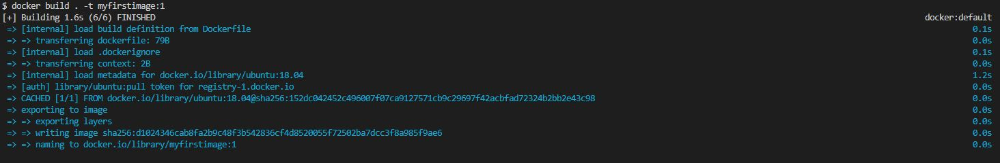
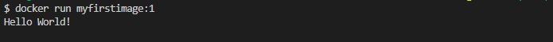

#### Docker Image Basics:
If you want to create a docker image you have to use Dockerfile, always with an uppercase D and without any file extensions. A Dockerfile is a text document that contains a set of instructions used to create a Docker image. These instructions tell Docker how to build the image by specifying what environment to use, what files to include, and what commands to run. Once a Docker image is created, it can be run as a container on any machine that has Docker installed, ensuring consistency in environments across different systems.
An Example of a Dockerfile:

```docker
FROM ubuntu:18.04
CMD echo "Hello World!"
``` 

Here are some of the most important syntax and commands used in a Dockerfile:

**FROM**: Specifies the base image to use as the starting point for building a new image. For example,
```docker
FROM ubuntu:18.04
``` 
starts the build process from the Ubuntu 18.04 image.

*Tip*: The "latest" tag in the FROM section is used to refer to the most recent version of an image in a repository. When you use a tag like latest, Docker pulls the most up-to-date version of that image at the time of building your Docker image. For example:
```docker
FROM ubuntu:latest
```
But it is not recommended in production environments, as it might come with some changes that might affect your code or configuration and break your code.

---

**CMD**: Provides a default command to run when a container starts from the image. There can only be one CMD instruction in a Dockerfile. If you specify more than one CMD, only the last CMD will take effect.
```docker
CMD echo "Hello World!"
``` 

---
#### Build an image:

`docker build` is a command used to create Docker images from a Dockerfile. To simply run the command for building a simple docker image that has ubuntu as its base image and prints a "Hello World!" as an output, you go to the path that your Dockerfile is and run the following command:
```bash
docker build . -t myfirstimage:1
``` 
The dot `.` in end of the command tells to look for the Dockerfile in the current path.

The `t` is for giving a tag to the image.



Now that we have build our image, lets run it:
```bash
docker run myfirstimage:1
``` 


Well done! You learned how to create your own image and run it.

