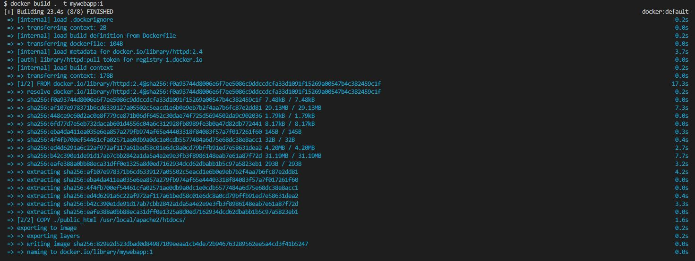
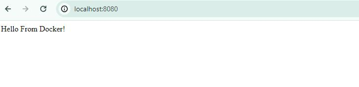

**COPY**:  Copies files and directories from the build context (the folder containing the Dockerfile) into the image.
```bash
COPY ./public_html /usr/local/apache2/htdocs/
``` 
---

To build it you can run the following command and expose the port of 8080 for your host and 80 for the httpd.

```bash
docker run mywebapp:1 -p 8080:80
``` 
---



---

