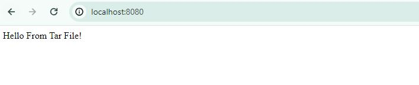

**ADD**: Similar to COPY, but can also handle remote URLs and unpack compressed files.
```bash
ADD test.txt relativeDir/
```
For remote URLs, `ADD` is not recommended by Docker to be used, because it doesn't support any sort of connection drop out or error handling. They suggest using `CURL` instead of `ADD`.

But another usecase of using `ADD` is for `tar` files. For example when we have a backup or website that has been compressed into tarball, we don't have to run any additional commands to extract it. `ADD` will handle all of that.
Here is a demo of using ADD in a Dockerfile for this usecase:

Creating a tar file:
```bash
tar -czvf webite.tar.gz -C webiste .
```
---

Building an image from the Dockerfile:
```bash
docker build . -t mywebapp:2
```

Running the container:
```bash
docker run -p 8080:80 mywebapp:2
```

---