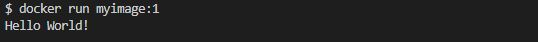
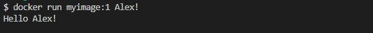

**ENTRYPOINT**: Allows you to configure a container that will run as an executable. It’s similar to CMD but is meant to run the container as a specific command.
```docker
FROM ubuntu:latest
ENTRYPOINT ["echo", "Something!"]
``` 

**RUN vs CMD vs ENTRYPOINT**:
`RUN` executes when we built the image, `CMD` and `ENTRYPOINT` executes when we run the container.
But what is the main difference between the `CMD` and `ENTRYPOINT`? The big difference between the two is that the `ENTRYPOINT` determines the main process to run. So whatever we want the process ID number 1 (PID 1) to be, that's when we use `ENTRYPOINT`. And `CMD` is like additional parameters we want to pass into `ENTRYPOINT`, and we can override the `CMD` too. 

Let's make it more clear with an example, we have a Dockerfile which has all the 3 commands:
```docker
FROM ubuntu:latest
RUN apt-get update && apt-get install -y git 
CMD ["World!"]
ENTRYPOINT [ "echo", "Hello"]
``` 

```bash
docker build . -t myimage:1
``` 

So while we are building the image and it gest to line `RUN apt-get update && apt-get install -y git`, it will update the apt-get and installs git in the image. Then we run the container, The container should execute the command from `ENTRYPOINT [ "echo", "Hello"]` which is an echo of `Hello`, but we also have `CMD ["World!"]`, and as we said CMD could be passed as parameters into the `ENTRYPOINT`, which `World` form CMD will be added to all the parameters inside the ENTRYPOINT and the result will be `Hello World!`.

```bash
docker run myimage:1
``` 


But as we said `CMD` can be overridden! How we do that? by passing new parameters while running the container we can override that:

```bash
docker run myimage:1 Alex!
``` 


In our example we passed "Alex!" to be replaced by "World!", in real world projects we can pass paramaters like 'prod', 'staging' and 'dev'.