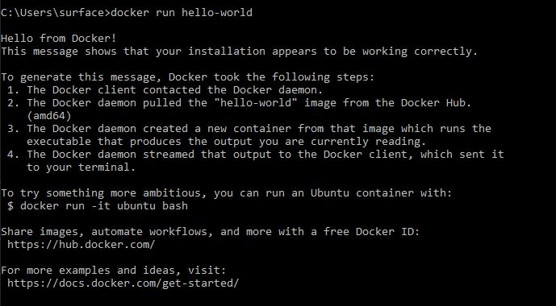

#### What is docker?
Docker is a platform that enables developers to create, deploy, and run applications in containers. It uses containerization technology to package applications and their dependencies into containers. These containers can then be easily moved between different environments, such as development, testing, and production, without any changes to the application code.

#### What problem does docker solve?
In traditional application deployment, physical servers were essential. For instance, we would typically use separate servers for different functions: one for the database (DB) and another for the application (App). Each of these servers operated with its own operating system (OS), alongside other configurations like networking.

However, this approach evolved with the advent of virtualization. This technology enabled us to use a single physical server to host multiple virtual servers. For example, we could have a virtual DB server and a virtual App server running concurrently. Each virtual server required its own virtual OS.

The introduction of Docker marked a further evolution in this field. Docker offers a cost-efficient way to not only virtualize servers but also to enable different servers to share a single OS. This is achieved while maintaining isolation between the servers, enhancing efficiency and resource utilization.

#### Docker Image vs Docker Container
A Docker image is essentially a blueprint, composed of a series of instructions, for creating a specific environment. For example, starting with a base image like Ubuntu, we can add various instructions. These might include downloading Python and setting up commands to run an app server.

When this Docker image is deployed, it transforms into a container. This means that an image serves as the set of instructions or the template for creating an environment tailored for our application. In contrast, a container is the actual, operational instance of this image, where the defined environment is live and running.

#### Process ID #1 in Docker Containers:

In Linux operating systems, the first process that the kernel starts is assigned Process ID (PID) 1. This is a key aspect in Docker containers as well: the PID 1 is designated to the primary application running within the container. For example, in a container set up for a database (DB), the database process itself would be PID 1.

Understanding the significance of PID 1 in Docker containers is crucial. This PID 1 process acts as the cornerstone of the container's operation. If this process encounters any issues, such as a crash or a restart, it directly impacts the container's stability. In such cases, the entire container ceases to operate, underscoring the critical role of the PID 1 process in the overall health and functionality of a Docker container.

#### Docker Hub:
Docker Hub is an online repository service where users can store, share, and manage their Docker images. Users can upload their own images, download others' images, and use them to quickly deploy and run applications in Docker containers.

#### Run your first docker container:
You need to install docker first on your machine, or if you have already installed that you need to start the Docker Engine.
In this step we are going to run a docker container, You can use google and search for docker hello-world image or directly going to the [docker hub website](https://hub.docker.com/ ) and search for hello-world. Whenever you need a base image, docker hub is really a good choice to go. If you have found the image you wanted in docker hub, copy the image name, in our case it will be "hello-world", then in your local machine, inside your terminal type the following command:

```docker
docker run hello-world
```

If this is your first time using hello-world image, as it can not find the image locally, it will start to pull the image from docker hub and then run it. Then you see a text saying: Hello from Docker!




*Tip*: When you don't specify the docker registry address in your command by default it will be docker hub registory. Later we will learn how to use other registry to pull/push images from.


*Next chapter*: Please go to `docker-image-basic` directory.